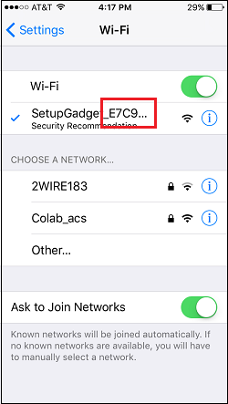

    

    
     
    <b>+</b> 
    
From the ITEAD website:  
    “Sonoff is a cost effective smart home solution designed and produced by 
    ITEAD. Sonoff is a ESP8266 based WiFi wireless switch that can connect to 
    appliance of different types and brands. Sonoff transmits data to cloud 
    platform through the WiFi” 
     
    The switch is controlled by the <b>eWeLink App</b> and managed in the cloud. 
     
    Control of this switch is through the eWeLink App in much the same fashion as a WeMo switch.  
     
    That is, these switches are tied to the manufacturers proprietary software. 
    This is a good system, however if one wishes to modify the functionality of 
    these switches one must work within the allowable guidelines of the 
    manufacturer. This is a roadblock for many home automation projects. 
     
    Replacing the firmware with a new open-source firmware disables the ITEAD/eWeLink 
    features and makes the switch unusable within their framework.

    
<b>This switch will not work with 
    ITEAD/eWeLink.</b>

    
However, open source firmware provides 
    much flexibility and many avenues of programming become available.  
     
    NodeMCU is open source. NodeMCU is programmed with the LUA programming language 
    and has modules to support just about any project imaginable.  
     
    This modification provides a base functionality, the switch can be 
    controlled from any web browser on the “local LAN”.&nbsp; The button also provides 
    a toggle so that manual operation of the switch is available.&nbsp; The LED 
    provides setup and operational status indication.
NodeMCU, from the master branch has been flashed to this switch.  
    Modules included are: 
    enduser_setup, file, gpio, http, mqtt, net, node, tmr, uart and wifi.

    

    Flashing the ESP8266 was accomplished by attaching a header to the 
    existing circuit board as illustrated here and using a 3.3v FTDI.

    

    
&nbsp;

    
&nbsp;

    
&nbsp;

    
&nbsp;

    
&nbsp;

    
&nbsp;

    
&nbsp;

    
&nbsp;

    
&nbsp;

    
&nbsp;

    
&nbsp;

    
&nbsp;

    
&nbsp;

    
&nbsp;

    

    

    
<b> 
    Caution!!&nbsp; It is possible to flash and 
    program the ESP8266 using the power from a 115vac or 240vac source, However 
    not recommended.&nbsp; </b>

    
<b>Accessing these pins also allow 
    access to the high voltage portions of this circuit board.&nbsp; This is a 
    shock hazard!</b>

    
<b>If you are attempting to do this 
    mod, use a 3.3v power supply and do not plug in the Sonoff to AC until fully 
    assembled.</b>

    

    
The ESP8266 is flashed using flash_download_tool_v1.2 and 
    programming files were uploaded via ESPlorer v0.2.0-rc2  
     
    Three scripts are uploaded to the file system of the ESP8266. 
    &quot;<b>init.lua</b>&quot; runs at boot automatically. 
    &quot;<b>servernode.lc</b>&quot; is called from init.lua if a good IP is acquired. 
    &quot;<b>state.lua</b>&quot; retains the state of the switch, on/off.&nbsp; When the 
    switch is power cycled the switch will set its self on or off based on the 
    last 'state'.

    
When setup and rebooted the switch returns a webpage 
    addressed by its assigned IP number:

    

    
<b>Setup:</b>

    
Simply plug the switch into an outlet. The LED will illuminate. 
    

    
If the LED 
    stays on for more than 5 seconds, the switch needs to be configured to 
    connect to your router 
     
    If the LED remains illuminated for more than 5 seconds, the switch is 
    automatically put into WiFi Access Point mode. 
     
    Use a wireless device, such as a laptop or smart phone to connect to the 
    switches access point. It will be listed as an available network. ie “SetupGadget_XXXXXX”.
     
     
    The “XXXXXX” will be replaced by the last 4 octets of the MAC address 
    printed on the bottom of the switch. In this example the network is named 
    “SetupGadget_E7C925”.

    

    
&nbsp;

    
&nbsp;

    
&nbsp;

    
&nbsp;

    
&nbsp;

    
&nbsp;

    
&nbsp;

    
&nbsp;

    
&nbsp;

    
&nbsp;

    
&nbsp;

    
&nbsp;

    
After successful connection to the network, open a browser 
    and browse to any website. (not https).

    
Or go directly to 192.168.4.1 and the setup screen will be displayed:

    
&nbsp;:

    
Select 
    your SSID and enter the Password:

    
&nbsp;.

    
&nbsp;

    
&nbsp;

    
&nbsp;

    
&nbsp;

    
&nbsp;

    
&nbsp;

    
&nbsp;

    
&nbsp;

    
&nbsp;

    
&nbsp;

    
&nbsp;

    
&nbsp;

    
Power cycle the switch.

    
Determine the switch's IP number. 
     
    The switch may be assigned an IP via DHCP by your router. You will need to 
    access your router to determine which IP has been assigned. 
     
    Alternatively, using the MAC address, a static IP can be setup in the router 
    ahead of this setup procedure. The Sonoff will be assigned the IP setup 
    manually. 
     
    You should now be able to access the switch at that IP number and toggle the 
    switch.  

    

    
&nbsp;

    
With NodeMCU installed it is now 
    possible to integrate this switch with existing systems.

    

    The MQTT module allows connection to brokers in the 
    cloud or a broker on your LAN providing ultra fast two way communication.

    
Integration with Amazon Echo, Dot and Tap is 
    possible with fauxmo.py.

    
The list goes on.....

 
